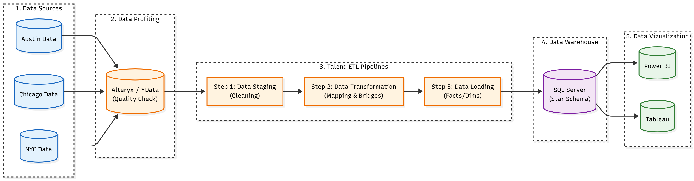

# CrashStat: Motor Vehicle Collision Data Warehouse

CrashStat analyzes motor vehicle collision data from **New York, Chicago, and Austin** to identify accident patterns, risk factors, and safety insights.  

The project implements a **full data warehouse solution** with:

- A **Medallion data architecture (Bronze → Silver → Gold)**
- **ETL pipelines** built in Talend
- A **SQL Server** dimensional model
- **Interactive dashboards** in Power BI (and Tableau prototypes)

---

## Objectives

- Quantify accident volumes across three cities  
- Identify top high-risk areas and most fatal locations  
- Analyze injury and fatality statistics by city  
- Assess pedestrian involvement and safety  
- Examine temporal patterns (time of day, day of week, seasonality)  
- Identify common contributing factors (e.g., driver behavior, environmental conditions)  

## Data Sources

**New York City**  
- [NYC Open Data – Motor Vehicle Collisions](https://data.cityofnewyork.us/Public-Safety/Motor-Vehicle-Collisions-Crashes/h9gi-nx95)

**Chicago**  
- [City of Chicago – Traffic Crashes](https://data.cityofchicago.org/Transportation/Traffic-Crashes-Crashes/85ca-t3if)

**Austin**  
- [City of Austin – Crash Report Data](https://data.austintexas.gov/Transportation-and-Mobility/Austin-Crash-Report-Data-Crash-Level-Records/y2wy-tgr5)

## Architecture

CrashStat follows a **Medallion data warehouse architecture**:

- **Bronze (Raw / Staging)** – Ingest raw collision data from city portals into staging tables with minimal transformation.  
- **Silver (Cleansed / Standardized)** – Clean, standardize, and integrate data across cities into conformed structures with consistent schemas.  
- **Gold (Dimensional / Analytics)** – Load a **star-schema dimensional model** (facts + dimensions with SCD Type 2) optimized for analytics and dashboards.  

## Implementation

### Bronze Layer – Data Profiling & Staging

- Profiled raw data using **Python (`ydata-profiling`)** and **Alteryx**  
- Identified quality issues: missing values, inconsistent formats, duplicates  
- Created **staging (Bronze) tables** in **SQL Server** with audit columns (source, load time, batch ID)  

### Silver Layer – ETL & Integration

- Built **ETL workflows in Talend Studio** to standardize, cleanse, and transform data  
- Harmonized key dimensions (location, date/time, severity, contributing factors) across NYC, Chicago, and Austin  
- Implemented **SCD Type 2** for slowly changing dimensions  
- Validated data integrity with SQL checks (row counts, referential integrity, null checks)  

### Gold Layer – Dimensional Model & BI

- Modeled a **dimensional warehouse** in SQL Server (fact + dimension tables)  
- Exposed **Gold-layer tables** to reporting tools for analytics  
- Developed dashboards in **Power BI** (and Tableau prototypes) to answer the project objectives  
- Implemented drill-down, slicing, and filtering by city, time period, severity, and contributing factors  

## Dashboards

**Power BI report:**  
[Open CrashStat Power BI Dashboard](https://app.powerbi.com/groups/me/reports/dda3d0e1-ed89-47eb-a83d-4058f6991367/ReportSection?experience=power-bi)

### 1. Overview & Temporal Analysis

- Total accident counts across three cities (**~3.04M collisions**)  
- Severity breakdown (e.g., injuries vs. fatalities; **4,964 injuries, 893K total injury count**)  
- Time-based analysis by hour, day of week, and month/season  
- Highlights peak accident periods and compares injury vs. fatal trends  

### 2. Geographic & Pedestrian Analysis

- Interactive map of collision hotspots across the three cities  
- Visuals for motor vehicle deaths and injuries by location  
- Trends in pedestrian accidents over time  
- Highlights dense urban corridors and zones with elevated pedestrian risk  

### 3. Contributing Factors Analysis

- Breakdown of top contributing factors (driver inattention, failure to yield, following too closely, unsafe speed, etc.)  
- Comparison of accident counts by city/data source  
- Identification of top 5 streets with the highest accident frequency  
- Severity metrics, including **1,695 motor vehicle deaths** and **466K person-vehicle injuries**  

## Technologies

| Category           | Technologies                                       |
|--------------------|----------------------------------------------------|
| Data Profiling     | Python (`ydata-profiling`), Alteryx               |
| ETL                | Talend Studio                                     |
| Data Warehouse     | SQL Server (Medallion: Bronze / Silver / Gold)    |
| Data Staging       | SQL Server, Excel exports                         |
| Visualization      | Power BI, Tableau (prototype views)               |
| Version Control    | Git, GitHub                                       |

## Key Insights

- **Geographic Hotspots:** accident clusters in downtown cores, major intersections, and arterial roads  
- **Temporal Patterns:** peak accidents during evening rush hours (5–7 PM) and Friday evenings, with distinct weekday vs. weekend trends  
- **Seasonal Trends:** higher collision frequency in winter months, with weather conditions amplifying risk  
- **Contributing Factors:** leading causes include driver inattention/distraction, failure to yield, following too closely, and unsafe speed  
- **Pedestrian Safety:** corridors with elevated pedestrian involvement highlight areas for crosswalk, signaling, or traffic-calming improvements  
- **Severity & Motorist Impact:** analysis of injuries and fatalities at city and aggregate levels surfaces high-risk locations for targeted safety campaigns and infrastructure changes  

## Author

**[Dhir Thacker](https://www.linkedin.com/in/dhirthacker7/)**  
Data & Business Analyst · ETL & BI · Traffic Safety Analytics
